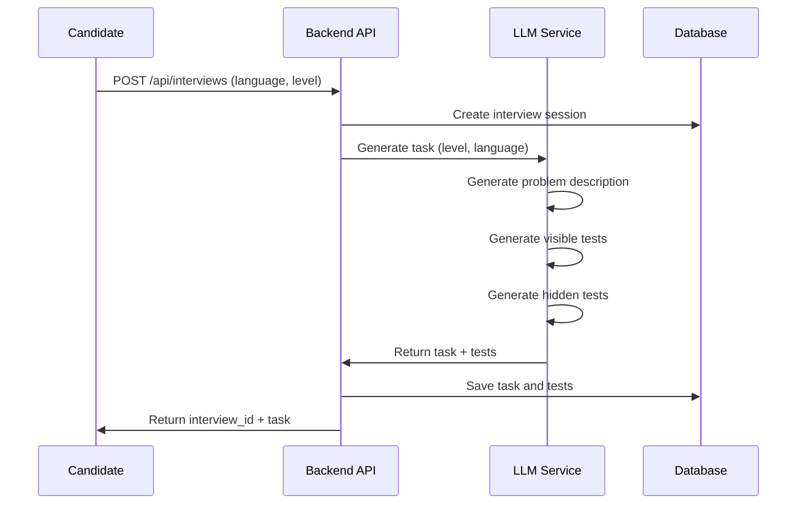
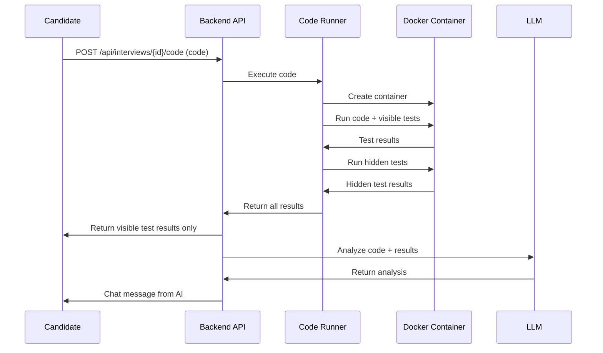
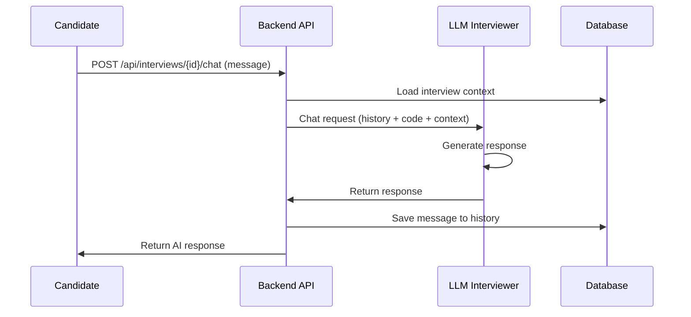
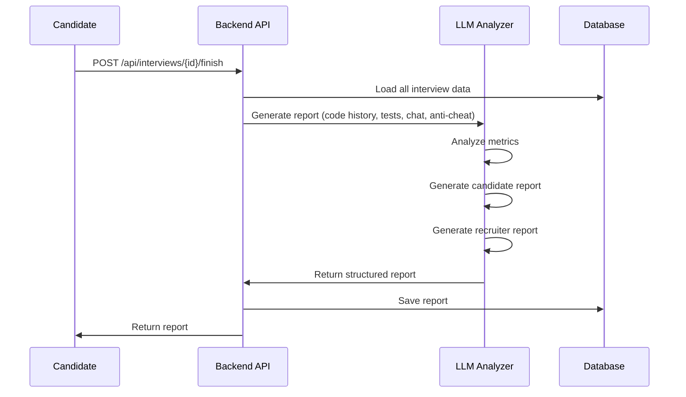

# Interview Flow

## Общий флоу интервью

### 1. Инициализация интервью

```
Кандидат → Выбор направления (Python/JavaScript) → Выбор уровня (Junior/Middle) 
→ Создание сессии интервью → Генерация начальной задачи
```

**Действия:**
- Пользователь выбирает язык программирования и уровень сложности
- Backend создаёт сессию интервью с уникальным ID
- LLM генерирует задачу соответствующего уровня
- Задача сохраняется в БД вместе с видимыми и скрытыми тестами

### 2. Работа над задачей

```
Кандидат пишет код в IDE → Сохранение кода → Запуск видимых тестов 
→ Получение результатов → Общение с ИИ-интервьюером в чате
```

**Действия:**
- Кандидат пишет код в Monaco Editor
- При сохранении/запуске код отправляется на Runner
- Runner выполняет код в изолированном Docker-контейнере
- Запускаются видимые тесты (результаты показываются кандидату)
- Скрытые тесты выполняются, но результаты не показываются
- ИИ-интервьюер анализирует код и задаёт вопросы в чате

### 3. Адаптивное взаимодействие

```
ИИ анализирует код → Определяет уровень понимания → Адаптирует вопросы 
→ Может усложнить/упростить задачу → Даёт подсказки при необходимости
```

**Действия:**
- LLM анализирует написанный код
- Оценивает подход, стиль, наличие ошибок
- Задаёт уточняющие вопросы в чате
- Может предложить улучшения или альтернативные подходы
- При необходимости генерирует дополнительные подзадачи

### 4. Анти-читинг мониторинг

```
Frontend отслеживает события → Отправка событий на Backend 
→ Агрегация событий по сессии → Включение в финальный отчёт
```

**События:**
- `big_paste` - большой вставленный фрагмент кода
- `devtools_opened` - открытие DevTools
- `copy_from_description` - копирование из описания задачи
- `disable_js_attempt` - попытка отключить JavaScript
- `suspicious_focus` - подозрительное переключение фокуса
- `tab_switch` - переключение вкладок

### 5. Завершение интервью

```
Кандидат завершает задачу → Финальный анализ кода → Генерация отчёта 
→ Показ отчёта кандидату → Сохранение отчёта для рекрутера
```

**Действия:**
- Кандидат нажимает "Завершить интервью"
- Backend запускает финальный анализ:
  - Анализ всех версий кода
  - Результаты всех тестов (видимых и скрытых)
  - Статистика по времени и памяти
  - Анализ анти-чит событий
  - Оценка soft-skills из чата
- LLM генерирует структурированный отчёт:
  - Метрики (правильность, оптимальность, стиль кода)
  - Текстовый отзыв для кандидата
  - Текстовый отзыв для рекрутера
  - Рекомендации по уровню

## Детальный флоу по этапам

### Этап 1: Генерация задачи



### Этап 2: Выполнение кода



### Этап 3: Чат с ИИ



### Этап 4: Генерация отчёта



## Состояния интервью

1. **CREATED** - Интервью создано, задача сгенерирована
2. **IN_PROGRESS** - Кандидат работает над задачей
3. **CODE_SUBMITTED** - Код отправлен, тесты запущены
4. **CHATTING** - Активное общение с ИИ
5. **FINISHED** - Интервью завершено, отчёт сгенерирован

## Метрики для анализа

- **Правильность**: Процент пройденных тестов (видимых и скрытых)
- **Оптимальность**: Анализ сложности алгоритма (Big O)
- **Стиль кода**: Читаемость, именование, структура
- **Soft-skills**: Качество общения в чате, объяснение подхода
- **Анти-читинг**: Количество и тип подозрительных событий

